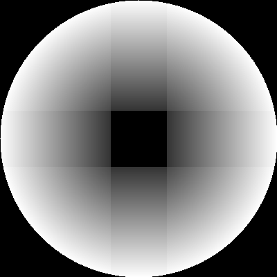
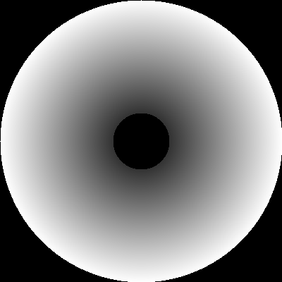
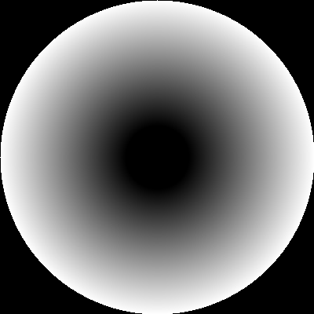
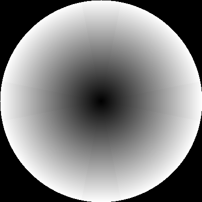
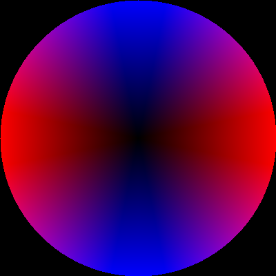
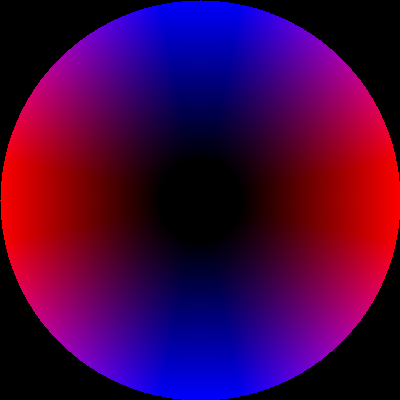
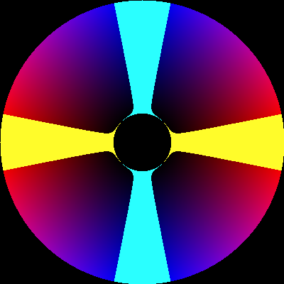
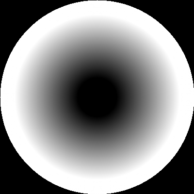
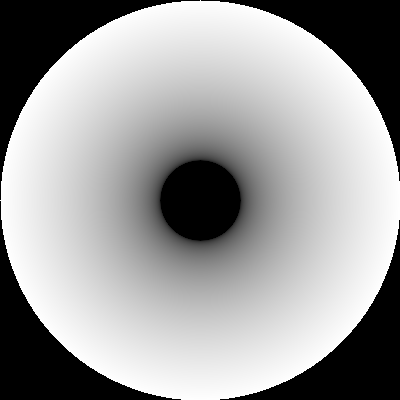

Understanding thumbstick deadzones
==================================

What's this?
------------

Gamepads and similar thumbstick controllers usually give an input value between -1 and 1 in two axis. Thus, when the stick is idle the expected value is (0, 0). However, most of times the given value is near but not equal to 0. The idea of deadzone is like a threshold value for thumbstick input. Although it seems pretty simple, it can lead us into trouble if we don't implement it carefully.

This work is an extension of [this great article](https://joshsutphin.com/pages/doing-thumbstick-dead-zones-right.html) by Josh Sutphin. Here I'll go through different approaches for implementing deadzones, along with a playable demo. I hope this helps someone to choose the right one for her project.

I recommend to open the [demo](https://minimuino.github.io/thumbstick-deadzones/demo/) in another tab and do some tests while reading this document. Source code can be found in the "demo" folder (powered by the [Phaser engine](https://phaser.io/)). Also, in the file "main.py" you can find the program I used to generate all the images below (powered by [OpenCV](https://opencv.org/)).

Deadzone types
--------------

Now I will discuss deadzone types. For each type, a graph and some python-ish pseudocode will be provided. First of all I will explain how to interpret the graphs. We will be working with two types of graphs, both of them represent all possible values of some thumbstick input (with an arbitrary sampling rate):

- Grayscale: magnitude of input vector.
- RGB: axis value of input vector.

Each pixel on the image corresponds to a single position of the stick. If we don't apply a deadzone, our raw input graphs will look like this:

---

![Legend - Grayscale][legend_gray]

---

![Legend - RGB][legend_rgb]

---

Open the [demo](https://minimuino.github.io/thumbstick-deadzones/demo/) and move around a bit, then release the stick. You'll see how the character moves slightly although there's no user input anymore. That's what we want to solve by applying a deadzone function to the raw input. We'll try first the simplest approach: axial deadzone.

<p align="center">
  
</p>

```python
def dz_axial(stick_input, deadzone):
	result = Vector2(stick_input)
	if (abs(result.x) < deadzone)
		result.x = 0
	if (abs(result.y) < deadzone)
		result.y = 0
	return result
```

This deadzone type causes kind of a "snap to grid" effect, very uncomfortable for 3D environments. At the demo, try to perform a slow circular motion, and you will notice this issue. So here is the next step, radial deadzone:

<p align="center">
  
</p>

```python
def dz_radial(stick_input, deadzone):
	input_magnitude = get_magnitude(stick_input)
	if input_magnitude < deadzone:
		return Vector2(0, 0)
	else:
		return Vector2(stick_input)
```

But with this deadzone type there is another issue: we lose precision on the process. We're no longer getting input between -1 and 1, but rather in the [-1, -deadzone] and [deadzone, 1] intervals. If by clamping input we lose precision, then we don't should clamp, but rather *scale* input. We want to turn that sharp black edge into a smooth transition. In order to do that, I'm using a function that takes a value from an input range and returns its equivalent in the specified output range (i.e. linear interpolation):

```python
def map_range(value, old_min, old_max, new_min, new_max):
	return (new_min + (new_max - new_min) * (value - old_min) / (old_max - old_min))
```

Then, we have our scaled radial deadzone:

<p align="center">
  
</p>

```python
def dz_scaled_radial(stick_input, deadzone):
	input_magnitude = get_magnitude(stick_input)
	if input_magnitude < deadzone:
		return Vector2(0, 0)
	else:
		input_normalized = stick_input / input_magnitude
		result = input_normalized * map_range(input_magnitude, deadzone, 1, 0, 1)
		return result
```

Now try the slowest movement you can perform with both radial and scaled radial deadzones. You will notice that with the scaled radial you have a wider speed range, in particular at low speeds. The transition from stillnes to movement is much smoother with scaled radial.

Ideally, this would be the deadzone that fits every project's needs. Unfortunately, this is not true. Sometimes we don't want the same amount of deadzone along an axis. At the demo, select the scaled radial deadzone and try to follow one of the horizontal blue lines at high speed. It's possible, but far from easy to get a pure horizontal motion (i.e. motion in X axis only). Look at the bottom left corner of the screen and try to get a 0 on the second axis. Many applications that work with analog input need at the same time to help the user to perform pure horizontal/vertical motion. So for this environments we need a special deadzone type.

How could we accomplish this? Well, one step at a time. We know that

1. Axial deadzone is good for pure horizontal/vertical motion (high input values)
2. Axial deadzone is bad for low input values, as it causes a "snap to grid" effect.
3. We need to scale the input to fit exactly the space outside the deadzone.

Points 1 and 2 lead us to the conclusion that we need a variable deadzone instead of a constant value. Like an axial deadzone function but with some slope in the edges, so that the deadzone is pretty low near the center and it constantly increases its value along the axis.

<p align="center">
  
</p>

```python
def dz_sloped_axial(stick_input, deadzone):
    deadzone_x = deadzone * abs(stick_input.y)
    deadzone_y = deadzone * abs(stick_input.x)
	result = Vector2(stick_input)
	if (abs(result.x) < deadzone_x)
		result.x = 0
	if (abs(result.y) < deadzone_y)
		result.y = 0
	return result
```

In the sample code you can see that now deadzone is split in two values (one for each axis). Note also that the deadzone amount for X axis depends on the current Y value, and vice versa.

Point 3 reminds us that is not a good thing to see edges on the graph. Edges mean sudden changes in motion, gradients mean smooth transitions. So, like we've done with radial deadzone, we may now *scale* the sloped axial in order to get rid of edges.

<p align="center">
  
</p>

```python
def dz_sloped_scaled_axial(stick_input, deadzone):
    deadzone_x = deadzone * abs(stick_input.y)
    deadzone_y = deadzone * abs(stick_input.x)
	result = Vector2(0, 0)
	sign = Vector2(get_sign(stick_input.x), get_sign(stick_input.y))
	if (abs(stick_input.x) > deadzone_x)
		result.x = sign.x * map_range(abs(stick_input.x), deadzone_x, 1, 0, 1)
	if (abs(stick_input.y) > deadzone_y)
		result.y = sign.y * map_range(abs(stick_input.y), deadzone_y, 1, 0, 1)
	return result
```

Now we shall combine this function with the scaled radial in order to avoid undesired input when the stick is released:

<p align="center">
  
</p>

```python
def dz_hybrid(stick_input, deadzone):
	input_magnitude = get_magnitude(stick_input)
    if input_magnitude < deadzone:
        return Vector2(0, 0)

    partial_output = dz_scaled_radial(stick_input, deadzone)

    final_output = dz_sloped_scaled_axial(partial_output, deadzone)

    return final_output
```

Note that the order in which the transformations are applied is relevant: scaled radial function must be called first in order to avoid distortion for low input values.

You may not see very much difference between this final graph and the first raw input RGB graph. So we're going to compare them now in order to see the subtle differences. The following graphs show two highlighted areas: yellow means `x =/= 0 AND y = 0`; cyan means `x = 0 AND y =/= 0`. Intuitively, if the stick position is within the yellow/cyan area we'll get input only in X/Y axis.

![No deadzone (highlighted)][dz_none_highlighted]


(left: input with no deadzone; right: input with hybrid deadzone)

As you can see, without a deadzone it will be very difficult for a user to give input in one axis only. However, with the hybrid deadzone there's a safe area to perform one-axis input whose width depends not only on the deadzone value, but also on the current input reading.

All the images above were generated with a deadzone value of 0.2 for illustrative purposes. In the real world it would be a bit excessive for a high-end controller, although the cheap ones actually need a value close to 0.2 in order to work properly.

### Outer deadzone

When the magnitude of the raw input value is above 1, we should normalize the vector to avoid returning a value higher than 1. But what happens if the thumbstick gives always a maximum value below 1? Depending on the case, we may get into trouble. If the vector magnitude of the input is critical in your game or application, you should apply also an outer deadzone, or at least let the user adjust it though the settings. This is what a scaled radial inner/outer deadzone looks like:

<p align="center">
  
</p>

```python
def dz_scaled_radial_inner_and_outer(stick_input, inner_deadzone, outer_deadzone):
	input_magnitude = get_magnitude(stick_input)
	if input_magnitude < inner_deadzone:
		return Vector2(0, 0)
	elif input_magnitude > (1 - outer_deadzone):
        return stick_input / input_magnitude
	else:
		input_normalized = stick_input / input_magnitude
		result = input_normalized * map_range(input_magnitude, inner_deadzone, 1 - outer_deadzone, 0, 1)
		return result
```

As you can see, there is a full white ring all along the outer zone of the input, meaning that any value that falls within that zone will be mapped to a normalized vector of magnitude equal to 1. Hence we have an inner deadzone where all values are shrinked to (0, 0) and an outer deadzone where all values are expanded to have length = 1.

### Beyond deadzones: non-linear input
Non-linear input mappings can be used to enhance precision in a certain interval, at the cost of losing precision on the other part. A common application for this kind of input are fine-grained aiming systems: with a thumbstick graph like the one below (left), users have a wider range of movements for low input values, which lets them to make very subtle adjustments much easier.

![Non linear input - Cubic][dz_cubic_gray]


```python
def dz_exp(stick_input, deadzone, n):
    partial_output = dz_scaled_radial(stick_input, deadzone)
    input_magnitude = get_magnitude(partial_output)
    if input_magnitude == 0:
        return Vector2(0, 0)
    input_normalized = partial_output / input_magnitude
    return input_normalized * pow(input_magnitude, n)
```

(left: n=3; right: n=0.33)

This technique must be combined with a deadzone in order to work well. In this example I've used a scaled radial deadzone, but I could have chosen any other. You may have noticed that this last function needs an additional parameter `n`. It's the exponent, and the function will behave as follows depending on the value of `n`:

- `n > 1`: Increase precision for low input values
- `n == 1`: No effect
- `n < 1 && n > 0`: Increase precision for high input values
- `n < 0`: No sense

This kind of input mapping is useful only in very specific situations, but in complex scenarios like 3D shooters or flight simulators you will probably have to implement dynamic deadzone changes depending on the action the user is performing. For example, on the left stick of a gamepad you may use some basic deadzone for player movement and a different one for vehicle movement; on the right stick you may use another deadzone for general camera movement and some non-linear mapping for high precision aiming.

Another interesting application of non-linear input mappings is directional adjustment, commonly used in aim assist for 2D games. This is a complex topic and is out of the scope of this article, but I will show a very simple example for you to see how it works. If you want to know more, this video contains a great explanation on this topic: https://www.youtube.com/watch?v=yGci-Lb87zs

image

pseudocode

Testing
-------

Relevant test cases for the demo:

1. Do not touch the stick. Does the character stand still?

2. Try to perform a really soft acceleration. Is the transition from stillness to movement sudden or smooth?

3. Is it possible to perform a **slow** horizontal/vertical motion with a soft slope? Or does it feel like there are only 3 directions (horizontal/vertical/diagonal)?

4. Is it easy to perform a pure horizontal/vertical motion?

5. Test how easy is to do the following: align character's feet with one of the deep blue horizontal lines' edge; after that, move along that edge for a couple of seconds; then start to move slowly towards the other edge of the line; when you've reached it, keep moving along that edge for another two seconds. You can do this test at various speeds.

6. With the right stick perform a circular motion at a constant angular speed. Does the character rotate smoothly? Or does he seem to "stop" for a moment at certain angles (specifically when X=0 or Y=0)?

I've been doing some testing with both Xbox 360 and PS3 official controllers (Debian + Firefox environment), and I've found something quite interesting: with PS3 controller there's no need to do deadzone processing at all. It works reeeally smooth in every case... with deadzone set to *None*! One may think that it could be just an excellent piece of hardware and no post-processing is needed. But test #6 reveals something against this hypothesis: it "stops" at certain angles, very similar to our hybrid deadzone behavior. That's a clear proof of a deadzone post-process running beneath the surface. Does the PS3 controller have kind of a built-in deadzone? Or is it the linux driver? No idea. So, please, if you can throw some light on this issue, I'd really appreciate it. I've also tested the Dualshock in Cocos2D engine with identical result.

Well, so below you can see the results table for these tests that I've run. You can reproduce them in the demo. Also, I'm looking forward to test Xbox ONE and PS4 controllers as soon as possible.

|  | 1 | 2 | 3 | 4 | 5 | 6 |
|--|---|---|---|---|---|---|
| **Axial** | PASS | FAIL | FAIL | PASS | FAIL | FAIL |
| **Scaled Radial** | PASS | PASS | PASS | FAIL | FAIL | PASS |
| **Hybrid** | PASS | PASS | PASS | PASS | PASS | FAIL |
| **PS3?** | PASS | PASS | PASS | PASS | PASS | FAIL |

Final notes
-----------
Well, that's all for now. I hope you've find it useful. Remember that there's no golden solution for every situation, so you have to pick the input mapping that best fits your needs. If you have any thoughts, new ideas or corrections, feel free to fork this repo or to submit a pull request! Thanks for reading! :]

### Future work
- Figure out how to get rid of distortion for low input values in hybrid deadzone
- Demo screen for stick input real-time visualisation

License
-------

Copyright (C)  2017  Carlos Pérez Ramil.

Permission is granted to copy, distribute and/or modify this document under the terms of the GNU Free Documentation License, Version 1.3 or any later version published by the Free Software Foundation; with no Invariant Sections, no Front-Cover Texts, and no Back-Cover Texts. A copy of the license is included in the file "fdl-1.3.txt".


[legend_gray]: demo/assets/image/legend_gray.png "Legend gray"
[legend_rgb]: demo/assets/image/legend_rgb.png "Legend rgb"
[dz_none_gray]: demo/assets/image/dz_none_gray.png "No deadzone"
[dz_none_rgb]: demo/assets/image/dz_none_rgb.png "No deadzone"
[dz_axial_gray]: demo/assets/image/dz_axial_gray.png "Axial deadzone"
[dz_axial_x_gray]: demo/assets/image/dz_axial_x_gray.png "Axial deadzone (x axis)"
[dz_axial_y_gray]: demo/assets/image/dz_axial_y_gray.png "Axial deadzone (y axis)"
[dz_radial_gray]: demo/assets/image/dz_radial_gray.png "Radial deadzone"
[dz_scaled_axial_gray]: demo/assets/image/dz_scaled_axial_gray.png "Scaled axial deadzone"
[dz_scaled_radial_gray]: demo/assets/image/dz_scaled_radial_gray.png "Scaled radial deadzone"
[dz_sloped_axial_gray]: demo/assets/image/dz_sloped_axial_gray.png "Sloped axial deadzone"
[dz_sloped_axial_rgb]: demo/assets/image/dz_sloped_axial_rgb.png "Sloped axial deadzone"
[dz_sloped_scaled_axial_rgb]: demo/assets/image/dz_sloped_scaled_axial_rgb.png "Sloped scaled axial deadzone"
[dz_hybrid_rgb]: demo/assets/image/dz_hybrid_rgb.png "Hybrid deadzone"
[dz_none_highlighted]: demo/assets/image/dz_none_highlighted.png "No deadzone"
[dz_cubic_gray]: demo/assets/image/dz_cubic_gray.png "Cubic"
[dz_cubicroot_gray]: demo/assets/image/dz_cubicroot_gray.png "Cubic root"
